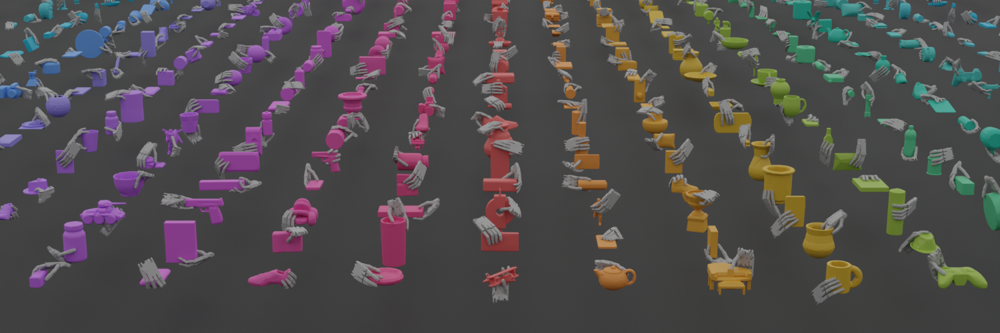
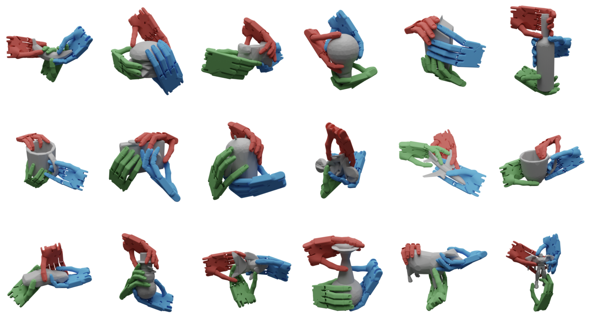
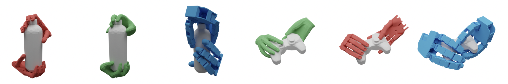

# CS586 Team 2 - Bimanual Dexterous Grasp Generation

## Collaborators & Acknowledgments

**Collaborators**: [dareumHJ](https://github.com/dareumHJ)  
**Based on**: [PKU-EPIC/DexGraspNet](https://github.com/PKU-EPIC/DexGraspNet)

---

## Overview

이 프로젝트는 CS586 수업의 팀2 프로젝트로, **양손(bimanual) 로봇 hand의 정교한 grasping pose 생성**을 구현합니다. PKU-EPIC의 DexGraspNet을 기반으로 하여 단일 hand grasp에서 양손 협력 grasp로 확장한 연구입니다.

### Key Features

- 🤖 **Bimanual Grasp Synthesis**: 양손 Shadow Hand의 협력적 grasping 알고리즘
- ⚡ **Physics-based Optimization**: 물리 기반 에너지 최적화 및 시뮬레이션
- 🎯 **Multi-object Support**: 다양한 3D 객체에 대한 안정적인 grasp 생성
- 🔬 **Real-time Simulation**: MuJoCo 기반 실시간 시뮬레이션 환경



---

## Environment Setup

### Prerequisites

이 프로젝트는 **Isaac Gym** 환경에서 개발되었습니다.

#### Core Dependencies

- **Python**: 3.7.16
- **PyTorch**: 1.12.1 (CUDA 11.6)
- **PyTorch3D**: 0.7.1
- **Isaac Gym**: 1.0rc4
- **CUDA**: 11.6 compatible GPU driver

#### Installation

1. **Conda 환경 복원** (권장)

```bash
# 정확한 환경 복원
conda create --name isaacgym --file settings/isaacgym_explicit.txt
conda activate isaacgym
```

1. **Isaac Gym 설치**
   - Isaac Gym을 별도로 다운로드하여 설치 필요
   - NVIDIA GPU 및 CUDA 11.6 호환 드라이버 필요

---

## Repository Structure

```
cs586/
├── grasp_generation/          # 🎯 메인 grasp 생성 알고리즘
│   ├── bimanual_main.py      # 양손 grasp 생성 (메인 기능)
│   ├── utils/                # 핵심 알고리즘 구현
│   │   ├── bimanual_energy.py
│   │   ├── bimanual_hand_model.py
│   │   ├── bimanual_initializations.py
│   │   └── ...
│   ├── scripts/              # 실험 및 검증 스크립트
│   ├── tests/                # 시각화 및 테스트
│   └── mjcf/                 # MuJoCo 모델 파일들
├── asset_process/            # 3D 모델 전처리
├── thirdparty/              # 외부 라이브러리
│   └── pytorch_kinematics/  # 운동학 계산
├── images/                  # 프로젝트 결과 이미지
├── settings/                # 환경 설정 파일들
└── config.json              # 최적화 파라미터
```

---

## Implementation

### Core Algorithm

#### 1. Bimanual Energy Function

최적화는 다음 에너지 함수들의 가중합을 최소화합니다:

```python
Total_Energy = w_dis * E_distance +
               w_pen * E_penetration +
               w_joints * E_joint_limits +
               w_bimpen * E_bimanual_penetration +  # 양손 간 충돌 방지
               w_vew * E_wrench_ellipse             # 힘 전달 효율성
```

#### 2. Optimization Process

- **Method**: Simulated Annealing with adaptive temperature
- **Contact Selection**: Stochastic contact point switching
- **Gradient**: PyTorch automatic differentiation

#### 3. Key Innovations

- **Inter-hand Collision Avoidance**: 양손 간 충돌 방지 에너지 항
- **Wrench Ellipsoid Volume**: 힘 전달 효율성 최적화
- **Adaptive Contact Selection**: 동적 접촉점 선택 알고리즘

### Usage

#### Quick Start

```bash
cd grasp_generation

# 양손 grasp 생성 (메인 기능)
python bimanual_main.py --name my_bimanual_exp --n_iter 8000 --batch_size 64

# 설정 커스터마이징
python bimanual_main.py \
    --object_code_list "['car_1', 'car_2', 'car_3']" \
    --n_contact 8 \
    --w_bimpen 50.0 \
    --w_vew 1.0
```

#### Configuration

주요 파라미터들 (`config.json` 또는 command line):

```json
{
  "n_iter": 8000, // 최적화 반복 횟수
  "w_bimpen": 50.0, // 양손 간 관통 방지 가중치
  "w_vew": 1.0, // Wrench ellipse 가중치
  "batch_size": 64, // 배치 크기 (양손용)
  "n_contact": 8 // 접촉점 수 (양손 총합)
}
```

---

## Results

실험 결과는 `../data/experiments/{experiment_name}/`에 저장됩니다:

- **`results/`**: 최종 양손 grasp pose 데이터
- **`logs/`**: 최적화 과정 로그 및 에너지 변화
- **`output.txt`**: 실험 설정 및 파라미터 정보

### Qualitative Results



### Multi-hand Capability



---

## Technical Details

### Physics Simulation

- **Engine**: MuJoCo with Isaac Gym acceleration
- **Hand Model**: Shadow Hand (left + right)
- **Contact Model**: Soft contact with friction

### Algorithmic Contributions

1. **Bimanual Energy Formulation**: 양손 협력을 위한 새로운 에너지 함수
2. **Efficient Contact Optimization**: 대규모 접촉점 최적화 알고리즘
3. **Stability Analysis**: Wrench space 기반 안정성 분석

---

## Course Information

- **Course**: CS586 - Advanced Topics in Computer Graphics
- **Institution**: KAIST
- **Team**: Team 2
- **Focus**: Bimanual Dexterous Manipulation

---

## License & Citation

Based on [DexGraspNet](https://github.com/PKU-EPIC/DexGraspNet) (CC BY-NC 4.0)

```bibtex
@article{wang2022dexgraspnet,
  title={DexGraspNet: A Large-Scale Robotic Dexterous Grasp Dataset for General Objects Based on Simulation},
  author={Wang, Ruicheng and Zhang, Jialiang and Chen, Jiayi and Xu, Yinzhen and Li, Puhao and Liu, Tengyu and Wang, He},
  journal={arXiv preprint arXiv:2210.02697},
  year={2022}
}
```
